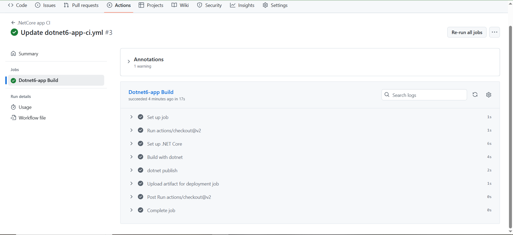

## CI Pipeline

The primary purpose of this Continuous Integration pipeline is to automatically compile, publish, and create a deployable artifact for the `dotnet6-app` whenever relevant changes are introduced to the source code.

| Parameter | Value |
| :--- | :--- |
| **Pipeline Name** | `.NetCore app CI` |
| **Target Framework** | .NET Core `6.0.x` |
| **Function** | Build, Publish, and Artifact Creation |

## Triggers
The pipeline is configured for both automated execution via code commits and manual invocation.

### 1. Automated Execution (`push`)

The workflow is triggered only when a code push occurs to the following branches and within specified file paths:

* **Target Branches:** `Dev`, `Stage`, and `main`.
* **Target Paths:** Any change within the application source code directory (`dotnet6-app/**`) or a change to the workflow file itself (`.github/workflows/dotnet6-app-ci.yml`).

### 2. Manual Execution

* **`workflow_dispatch`:** Allows developers or operators to manually initiate the pipeline directly from the GitHub Actions user interface.

---

## Build Stage (`Dotnet6-app Build`)

| Step Name | Function | Details |
| :--- | :--- | :--- |
| **Checkout Code** | Retrieves the code from the repository. | `uses: actions/checkout@v2` |
| **Set up .NET Core** | Configures the build environment by installing the necessary .NET SDK. | Installs version `${{ env.DOTNET_VERSION }}` (`6.0.x`). |
| **Build with dotnet** | Compiles the application. | Executes `dotnet build --configuration Release`. |
| **dotnet publish** | Packages the compiled application and all its dependencies into a single deployment output folder. | Executes `dotnet publish -c Release -o .../Dotnet6-App-Artifact`. |
| **Upload artifact** | Persists the published application files as an artifact. | `uses: actions/upload-artifact@v4` |

## Output Artifact

The result of a successful run is a deployment-ready artifact.

| Property | Value |
| :--- | :--- |
| **Artifact Name** | **`.net-app-${{ github.ref_name }}`** |
| **Dynamic Naming** | The artifact is dynamically named to include the triggering branch (`Dev`, `Stage`, or `main`), ensuring traceability and separation for subsequent deployment environments. |

## Screenshots 

1. Build Pipeline:
